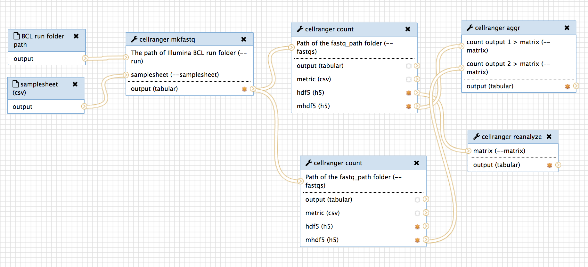

# galaxy wrapper for 10xgenomics single-cell RNA-seq pipeline

[Cell ranger](https://support.10xgenomics.com/single-cell-gene-expression/software/pipelines/latest/what-is-cell-ranger) is a set of analysis pipelines that process Chromium single-cell RNA-seq output to align reads, generate gene-cell matrices and perform clustering and gene expression analysis. Cell Ranger includes four pipelines relevant to single-cell gene expression experiments:




- [x] **cellranger mkfastq** demultiplexes raw base call (BCL) files generated by Illumina sequencers into FASTQ files. It is a wrapper around Illumina's bcl2fastq, with additional useful features that are specific to 10x libraries and a simplified sample sheet format.

```
PACKAGE_BASE=/mnt/galaxyTools/tools/illumina/v2.19.1; export PACKAGE_BASE; . /mnt/galaxyTools/tools/illumina/v2.19.1/env.sh;
PACKAGE_BASE=/mnt/galaxyTools/tools/cellranger/2.2.0; export PACKAGE_BASE; . /mnt/galaxyTools/tools/cellranger/2.2.0/env.sh

cellranger mkfastq --run=/scratch/galaxy/test/10xgenomics/cellranger-2.2.0/test/cellranger-tiny-bcl-1.2.0    
                   --samplesheet=/scratch/galaxy/test/10xgenomics/cellranger-2.2.0/cellranger-tiny-bcl-simple-1.2.0.csv
```

- [x] **cellranger count** takes FASTQ files from cellranger mkfastq and performs alignment, filtering, barcode counting, and UMI counting. It uses the Chromium cellular barcodes to generate gene-barcode matrices, determine clusters, and perform gene expression analysis. The count pipeline can take input from multiple sequencing runs on the same library.

```
PACKAGE_BASE=/mnt/galaxyTools/tools/cellranger/2.2.0; export PACKAGE_BASE; . /mnt/galaxyTools/tools/cellranger/2.2.0/env.sh; PACKAGE_BASE=/mnt/galaxyTools/tools/illumina/v2.19.1; export PACKAGE_BASE; . /mnt/galaxyTools/tools/illumina/v2.19.1/env.sh

cellranger count --id=sample345 \
                   --transcriptome=/scratch/galaxy/test/10xgenomics/refdata-cellranger-GRCh38-1.2.0 \
                   --fastqs=/scratch/galaxy/test/10xgenomics/H35KCBCXY/outs/fastq_path \
                   --sample=test_sample \
                   --expect-cells=1000 \
                   --chemistry=threeprime
```

* all the chemistry options are maybe needed as shown below:

```
--chemistry=CHEM    Assay configuration. One of: 'auto' for autodetection,
                        'threeprime' for Single Cell 3', 'fiveprime' for
                        Single Cell 5', 'SC3Pv1' or 'SC3Pv2' for Single
                        Cell 3' v1/v2, 'SC5P-PE' or 'SC5P-R2' for
                        Single Cell 5' paired-end/R2-only. Default: auto.
```

* cellranger aggr is for multiple-runs. Perhaps, less urgent than other tools.

- [ ] **cellranger aggr** aggregates outputs from multiple runs of cellranger count, normalizing those runs to the same sequencing depth and then recomputing the gene-barcode matrices and analysis on the combined data. The aggr pipeline can be used to combine data from multiple samples into an experiment-wide gene-barcode matrix and analysis.


- [x] **cellranger reanalyze** takes gene-barcode matrices produced by cellranger count or cellranger aggr and reruns the dimensionality reduction, clustering, and gene expression algorithms using tunable parameter settings.

```
PACKAGE_BASE=/mnt/galaxyTools/tools/cellranger/2.2.0; export PACKAGE_BASE; . /mnt/galaxyTools/tools/cellranger/2.2.0/env.sh; PACKAGE_BASE=/mnt/galaxyTools/tools/illu
mina/v2.19.1; export PACKAGE_BASE; . /mnt/galaxyTools/tools/illumina/v2.19.1/env.sh

cellranger reanalyze --id=sample345_reanalysis \
                     --matrix=/scratch/galaxy/test/10xgenomics/sample345/outs/filtered_gene_bc_matrices_h5.h5 \
```
